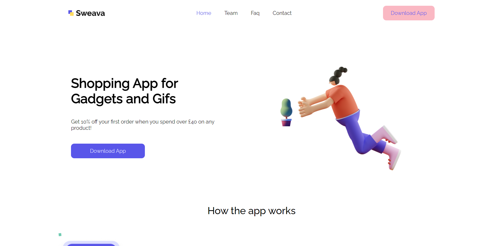
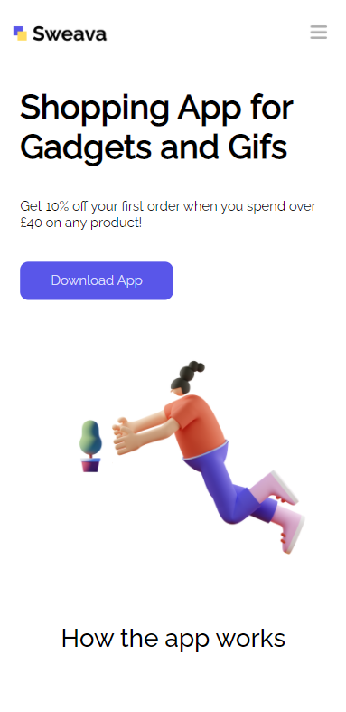

# Landing Page - Ecommerce App

## Description

We made the landing page of the Ecommerce App, desktop and mobile in REACT. Using pure css.

Contributors:

* Rafael Romero 
    * [github: RafaRomero8](https://github.com/RafaRomero8 "github")

* Eduardo De Alba
    * [github: spartanfenix](https://github.com/spartanfenix "github")

Application made with:
```
npx create-react-app maquetado-react
```


---
Landing page - desktop
<!--Imagen del lading page desktop-->

___
Landing page - mobile
<!--Imagen del lading page mobile -->


---
# Instructions

## How to get started
0. Inside the repository, select the clone option.
1. In your virtual machine go to the folder you want to work with.

2. Enter the following - if you cloned with http: 
```
 https://github.com/RafaRomero8/Maquetado-react.git 
``` 
3. Install the dependencies: 
``` 
npm install 
``` 
4. And run with: 
```
npm start
```
And ready!